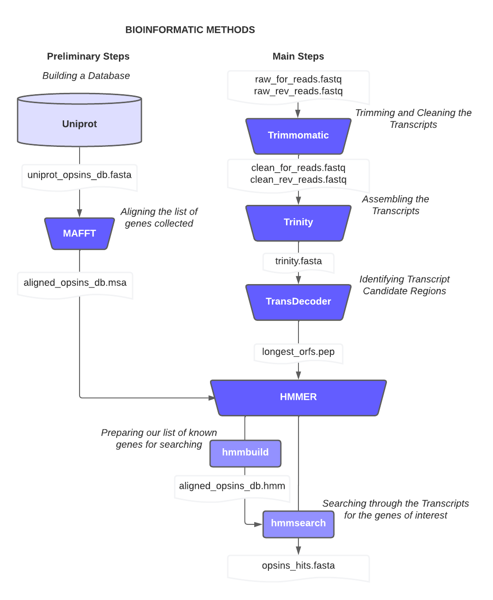
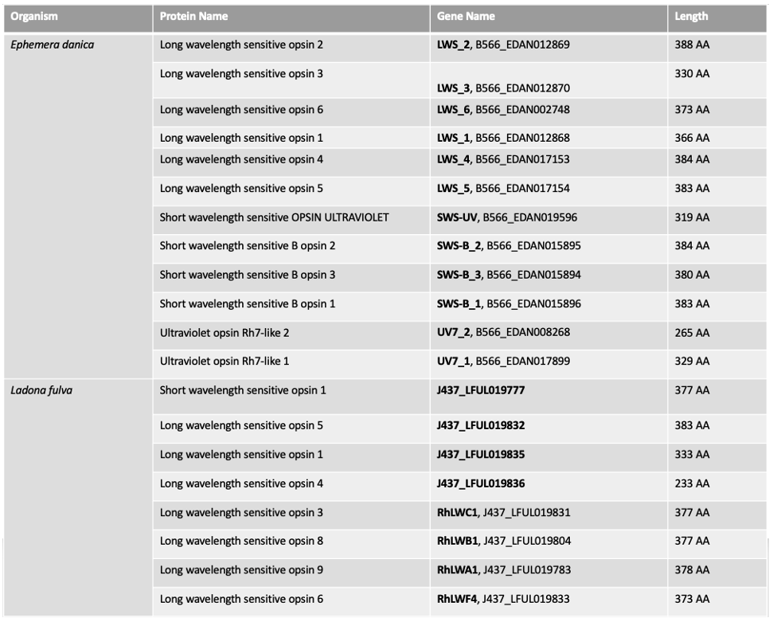
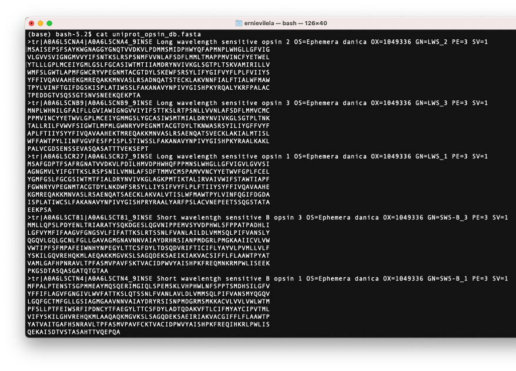
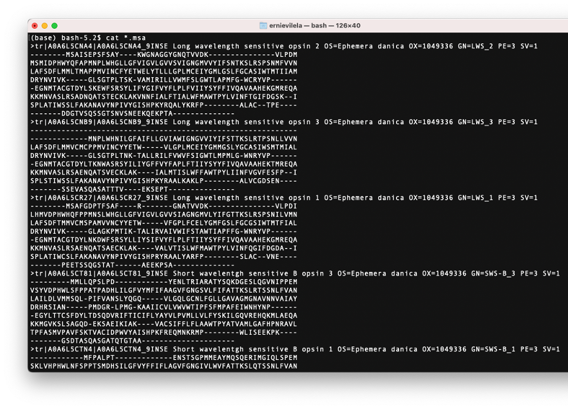
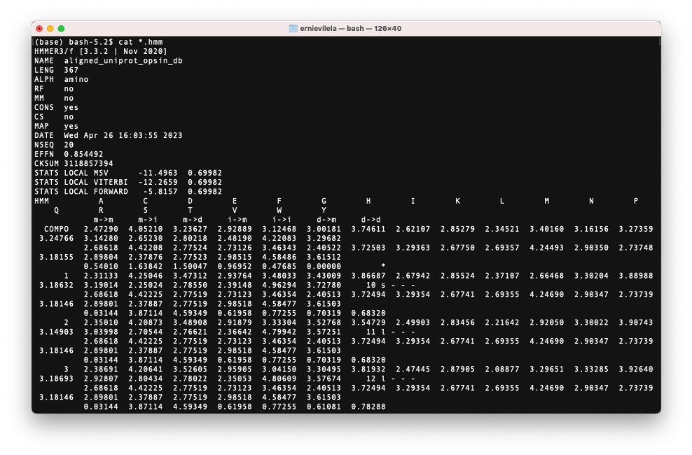
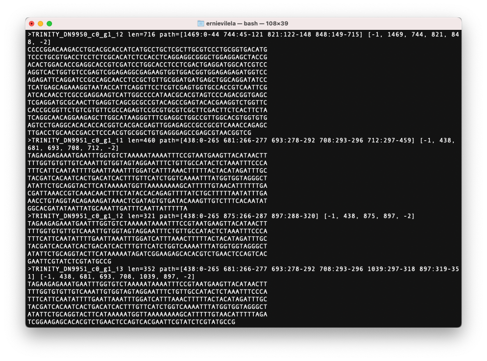
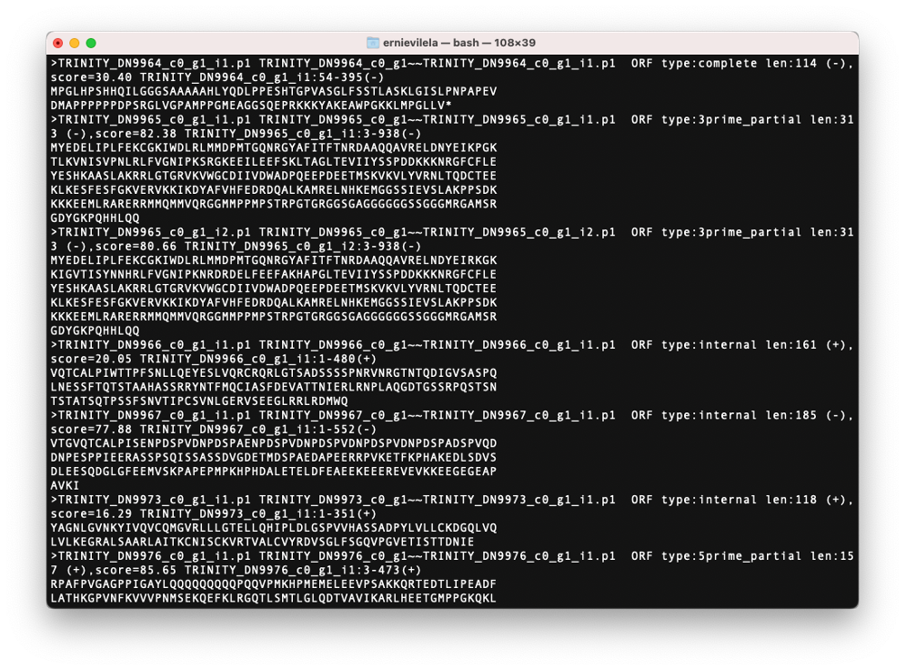
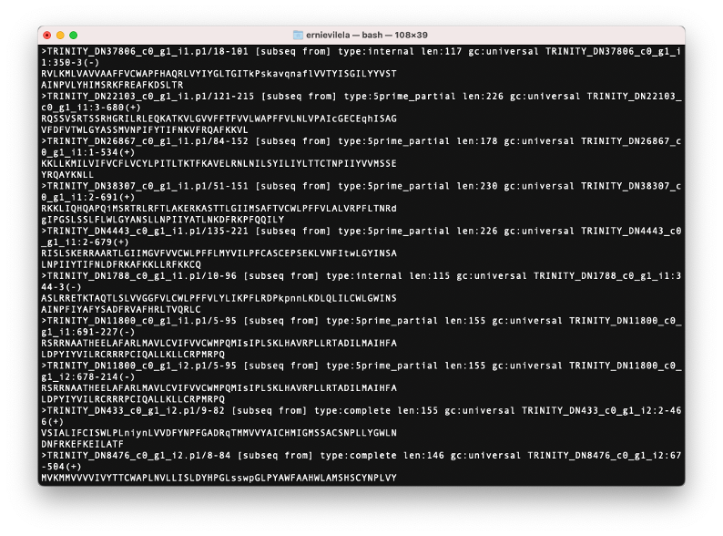

A Bioinformatic Workflow for Transcriptome Analysis of Opsin genes in Ephemeroptera (Mayflies)
=================
+ **Author: Ernie Vilela **
+ **Date: Last Updated 05/05/2023**

The workflow was developed using Command Line Terminal and UNIX resources in MacOS. 

## METHODS
+ Steps in the Bioinformatic workflow.

The cylinder represents a database. Trapezoids in color represent the software packages used in the workflow. Boxes in white represent the data files that went into the software packages and the files produced by the software packages. Lucidchart (2023) graphical tools used to create this chart.


### Preliminary Steps - Building a Database:

#### Downloading Data: 
+ Downloading database date from UniProt. In the following lists, only Long Wavelength, Short Wavelength, and Ultraviolet were downloaded. Also, sequences length ranged from 201 to 400


  - https://www.uniprot.org/uniprotkb?facets=length%3A%5B201%20TO%20400%5D&query=opsin%20ephemeroptera 

  - https://www.uniprot.org/uniprotkb?facets=length%3A%5B201%20TO%20400%5D&query=opsin%20ephemeroptera 

Table 1. A list of all the Uniprot sequences used.

#### Consolidating the Data:
+ After downloading the lists we must consolidate these two files into a new file. Uncompress the files with `gunzip` if necessary: 


``` bash
//input
    gunzip uniprot-compressed.fasta.gz #uncompressing
    ll uniprot* #this command to list all of the uniprot files. 
    grep -c '>' uniprot* #this will give us a glimpse for how many protein sequences we have in both files
        
```
``` 
//output
    uniprot_eph.fasta:12
    uniprot_odo.fasta:8
```

``` bash
//input
  cat *.fasta >> uniprot_opsin_db.fasta #concatenating / merging both files / naming the new file uniprot_opsin_db.fasta
  #after this, we check...
  grep -c '>' uniprot_opsin_db.fasta 
        #the output should be 20, so the merge was successful. 
  #now we do the actual moving of the database files to our blastdb directory created in the root directory. 
  mv uniprot_opsin_db.fasta $HOME/blastdb
        #this contain the list of proteins of interest (the genes that code for opsins. )
        
```


All sequences consolidated in one file. 

#### Aligning the Data:

NOTE: MAFFT v7.490 (Katoh et al, 2013) must be downloaded and installed before this steps.  [MAFFT Download instructions here.](https://mafft.cbrc.jp/alignment/software/macportable.html)

+ Once installed, MAFFT was used to align the fasta file containing our sequences for our database. 
        
``` bash
#Command Parameters:  
#[the location of the mafft.bat ] [our database file ] > [the neame of the new file to be aligned.msa]
    ../mafft-mac/mafft.bat uniprot_opsin_db.fasta > aligned_uniprot_opsin_db.msa
    #then glimpse at the file created 
    nano aligned_uniprot_opsin_db.msa
          
```

Aligned sequences after the alignement was performed .

#### Creating a Database Profile:
NOTE: HMMER v3.3.2 (EddyRivasLab, 2018) must be downloaded and installed before this steps.  [HMMER Download instructions here.](http://hmmer.org/)

+ After the alignment, these sequences were processed using HMMER v3.3.2 (EddyRivasLab, 2018) to build a Hidden-Markov profile in preparation for the future search of homologous sequences. Building a profile is a way to be more memory efficient within the HMMER software. 
        
``` bash
    
    #Command Parameters:   [hmmrbuild] [name of the new file to be created .hmm] [the name of the aligned db file .msa]
    hmmbuild hmmb_aligned_uniprot_opsin_db.hmm aligned_uniprot_opsin_db.msa

    #Inspection of the  hmm file was done by using the following commands
    ls -lh
    head *.hmm
    cat *.hmm
          
```

Sequences after the profile was built 

### Main Steps:

### Step 1 - Trimming and Cleaning the transcripts:
NOTE: [FastQC Use instructions here.](https://github.com/s-andrews/FastQC) Trimmomatic v.0.27 (Bolger et al, 2014)  must be downloaded and installed before these steps[. Trimmomatic Download instructions here.](https://github.com/usadellab/Trimmomatic) 


+ The raw transcriptome sequences went through quality controls assessment before and after trimming. The program used was FastQC v0.12.0 (Andrews, 2010 ). 
+ Trimming was performed using Trimmomatic v.0.27 (Bolger et al, 2014). 

``` bash
 #make a trimmomatic file sbatch .sh
 
    #The following are the contents of trim.sh
    $nano trim.sh
                #! /bin/bash
                java -jar /opt/Trimomatic-0.3/trimmomatic \
                        PE \
                        -phread33 \
                        -threads 6 \
                        SRRFILE_1.fastq.gz\ #feed in forward
                        SRRFILE_2.fastq.gz\ #feed in reverse file
                        clean_1.fastq.gz\ #output of the clean forward reads 
                        unpaired_1.fastq.gz\ #output of the unpair forward reads 
                        clean_2.fastq.gz\ #output of the clean reverse reads 
                        unpaired_2.fastq.gz\ #output of the unpair reverse reads 
                        ILLUMINACLIP:/opt/Trimmomatic-0.38/adapters/allAdapter.fas:2:30:10 \ #READ our set of sequences in the adapters folder, and it will determine the quality of how close we want these adapter to find our sequences.
                        LEADING: 30\ #If the quality is higher than 30, it will be kept. 
                        TRAILING: 30\
                        HEADCROP: 5:30\ #removed the first 5 bases
                        SLIDINGWINDOW: 5:30 \
                        MINLEN:50\ #Minimum lenght
            
        $CTRL + O
        $CTRL + X
        #at the end of this, save this where your files SRRFILE_1.fastq.gz\ and SSFILE_2.fastq.gz\ are located
 #you may now analyse these files by using fastqc, again. 
```

### STEP 2 - Assembling the transcripts:
NOTE: Trinity v2.15.1 (Grabherr et al, 2011)  must be downloaded and installed before these steps[. Trinity Download instructions here.](https://github.com/trinityrnaseq/trinityrnaseq.git) 

+ The forward and reverse reads were broken up and assembled. At the end of the process, the fastq files were converted into one fasta file containing the assembled sequences for each transcript. 
``` bash
        # Run trinity via:  $TRINITY_HOME/Trinity
        # At this point Trinity should be installed. 
        # NOW, To Launch Trinity, simply do the command: 
        $Trinity 

    #Using Trinity (prl script)
    #go to the desired location where your clean forward and reverse files are: clean_1.fastq.gz and clean_2.fastq.gz
    #Now let's run the trinity assembly (this will take several hours)
    $ .../opt/trinity/Trinity/ --seqType fq --max_memory 50G --left clean_1.fq --right clean_2.fq --CPU 6 --SS_lib_type RF
    
    ####At the end of trinity, the output needed to proceed will be the file
    trinity.fasta 
```

A glimpse of the Trinity output, `Trinity.fasta` file.


### STEP 3 - Identifying candidate coding regions:
NOTE: TransDecoder v5.7.0 (Haas, n.d.)  must be downloaded and installed before these steps[. Transdecoder Download instructions here.](https://github.com/TransDecoder/TransDecoder/releases) 

+ The assembled transcripts were processed by the TransDecoder v5.7.0 software (Haas, n.d.) in order to identify candidate coding regions within the transcript sequences. TransDecoder v5.7.0 searches for open reading frames in our assembly. A minimum protein length was 100 aminoacids. Once the TransdeCoder v5.7.0  process was completed, it produced several usable files. The file containing the list of translated amino acids that were identified was used to continue with the analysis (longest_orf.pep file ). At this point of the process, TransDecoder v5.7.0 identified which transcripts have coding regions. This process was repeated in order to identify the coding regions from each transcriptome for each species.

``` bash
# Extract the base frequencies with transdecoder on the trinity ouput : 
$TransDecoder.Longorfs -t ../data/fasta_files/EP017.fasta
        
```
```
//output
  #-first extracting base frequencies, we'll need them later.


        #- extracting ORFs from transcripts.
        #-total transcripts to examine:    93298
        #[93200/   93298] = 99.89% done    CMD: touch /Users/ernievilela/Documents/Classes/Spring_2023/Senior_Thesis/TransDecoder-TransDecoder-v5.7.0/EP017.fasta.transdecoder_dir.__checkpoints_longorfs/TD.longorfs.ok


        #################################
        ### Done preparing long ORFs.  ###
        ##################################

        #	Use file: /Users/ernievilela/Documents/Classes/Spring_2023/Senior_Thesis/TransDecoder-TransDecoder-v5.7.0/EP017.fasta.transdecoder_dir/longest_orfs.pep  for Pfam and/or BlastP searches to enable homology-based coding region identification.

        #	Then, run TransDecoder.Predict for your final coding region predictions.
```
``` bash
#Once this is done running, run TransDecoder.Predict
$TransDecoder.Predict -t ../data/fasta_files/EP017.fasta
#Making cds file: EP017.fasta.transdecoder.cds
#transdecoder is finished.  See output files EP017.fasta.transdecoder.*

```


A glimpse of the file containing the peptide sequences from the TransDecoder ouput, `longest_orfs.pep` file.

### STEP 4 - Searching biological sequence databases for homologous sequences:

+ Using the built protein database (list of genes of interest) from the preliminary step and the identified candidate coding regions from TransDecoder v5.7.0, a search was carried out using the HMMER software. 

``` bash
 ##At this point, make sure you copy your database (sequences to identify) to the hmmer folder. 
  
#Searching using HMMER
#Command Parameters: [hmmsearch ] [ dbfile.hmm] [fullgenomefile.fasta]
hmmsearch -A EP017_hits.txt hmmb_aligned_uniprot_opsin_db.hmm /Users/ernievilela/Documents/Classes/Spring_2023/Senior_Thesis/TransDecoder-TransDecoder-v5.7.0/transdecoder_output/EP017_transdecoder_output/EP017.fasta.transdecoder_dir/longest_orfs.pep

#Now we reformat from .txt to fasta to get all the hits
esl-reformat fasta EP017_hits.txt > EP017_hits.fasta
#this is the end! We found our hits!!! 

#Now we look for those matches that are labeled complete 
$grep -c 'complete' EP017_hits.fasta 

```
HMMER was able to produce a list of matches or hits of opsins for each transcriptome. 



A glimpse of the file containing all the database hits and matches to opsin genes, `opsin_hits.fasta` file.


### **REFERENCES**
<p style='margin:0in;line-height:150%;font-size:15px;font-family:"Arial",sans-serif;margin-left:22.5pt;text-indent:-22.5pt;'><span style='font-size:16px;line-height:150%;font-family:"Times New Roman",serif;background:white;'>Almudi, I., Vizueta, J., Wyatt, C.D.R. <em>et al.</em> Genomic adaptations to aquatic and aerial life in mayflies and the origin of insect wings. <em>Nat Commun</em> 11, 2631 (2020). https://doi.org/10.1038/s41467-020-16284-8</span></p>
<p style='margin:0in;line-height:150%;font-size:15px;font-family:"Arial",sans-serif;margin-left:22.5pt;text-indent:-22.5pt;'><span style='font-size:16px;line-height:150%;font-family:"Times New Roman",serif;background:white;'>Andrews S. (2010). FastQC: a quality control tool for high throughput sequence data. Available online at:&nbsp;</span><a href="http://www.bioinformatics.babraham.ac.uk/projects/fastqc"><span style='font-size:16px;line-height:150%;font-family:"Times New Roman",serif;color:windowtext;background:white;'>http://www.bioinformatics.babraham.ac.uk/projects/fastqc</span></a></p>
<p style='margin:0in;line-height:150%;font-size:15px;font-family:"Arial",sans-serif;margin-left:22.5pt;text-indent:-22.5pt;'><span style='font-size:16px;line-height:150%;font-family:"Times New Roman",serif;background:white;'>Bolger AM, Lohse M, Usadel B. Trimmomatic: a flexible trimmer for Illumina sequence data. Bioinformatics. 2014 Aug 1;30(15):2114-20. doi: 10.1093/bioinformatics/btu170. Epub 2014 Apr 1. PMID: 24695404; PMCID: PMC4103590.</span></p>
<p style='margin:0in;line-height:150%;font-size:15px;font-family:"Arial",sans-serif;margin-left:22.5pt;text-indent:-22.5pt;'><span style='font-size:16px;line-height:150%;font-family:"Times New Roman",serif;background:white;'>EddyRivasLab. (2018). EddyRivasLab/hmmer. Retrieved from&nbsp;</span><a href="https://github.com/EddyRivasLab/hmmer"><span style='font-size:16px;line-height:150%;font-family:"Times New Roman",serif;color:windowtext;background:white;'>https://github.com/EddyRivasLab/hmmer</span></a></p>
<p style='margin:0in;line-height:115%;font-size:15px;font-family:"Arial",sans-serif;margin-left:22.5pt;text-indent:-22.5pt;'><span style='font-size:16px;line-height:115%;font-family:"Times New Roman",serif;'>Grabherr MG, Haas BJ, Yassour M, Levin JZ, Thompson DA, Amit I, Adiconis X, Fan L, Raychowdhury R, Zeng Q, Chen Z, Mauceli E, Hacohen N, Gnirke A, Rhind N, di Palma F, Birren BW, Nusbaum C, Lindblad-Toh K, Friedman N, Regev A. Full-length transcriptome assembly from RNA-seq data without a reference genome. Nat Biotechnol. 2011 May 15;29(7):644-52. doi: 10.1038/nbt.1883. PubMed PMID: 21572440.</span></p>
<p style='margin:0in;line-height:115%;font-size:15px;font-family:"Arial",sans-serif;margin-left:22.5pt;text-indent:-22.5pt;'><span style='font-size:16px;line-height:115%;font-family:"Times New Roman",serif;background:white;'>Guignard Q, Allison JD, Slippers B. The evolution of insect visual opsin genes with specific consideration of the influence of ocelli and life history traits. BMC Ecol Evol. 2022 Jan 7;22(1):2. doi: 10.1186/s12862-022-01960-8. PMID: 34996358; PMCID: PMC8739693.</span></p>
<p style='margin:0in;line-height:115%;font-size:15px;font-family:"Arial",sans-serif;margin-left:22.5pt;text-indent:-22.5pt;'><span style='font-size:16px;line-height:115%;font-family:"Times New Roman",serif;'>H&ouml;lzer, M., &amp; Marz, M. (2019). De novo transcriptome assembly: A comprehensive cross-species comparison of short-read RNA-Seq assemblers.</span></p>
<p style='margin:0in;line-height:115%;font-size:15px;font-family:"Arial",sans-serif;margin-left:22.5pt;text-indent:-22.5pt;'><span style='font-size:16px;line-height:115%;font-family:"Times New Roman",serif;background:white;'>Katoh K, Standley DM. MAFFT multiple sequence alignment software version 7: improvements in performance and usability. Mol Biol Evol. 2013 Apr;30(4):772-80. doi: 10.1093/molbev/mst010. Epub 2013 Jan 16. PMID: 23329690; PMCID: PMC3603318.</span></p>
<p style='margin:0in;line-height:115%;font-size:15px;font-family:"Arial",sans-serif;margin-left:22.5pt;text-indent:-22.5pt;'><span style='font-size:16px;line-height:115%;font-family:"Times New Roman",serif;'>Lucidchart. (2023) Created in Lucidchart, www.lucidchart.com</span></p>
<p style='margin:0in;line-height:115%;font-size:15px;font-family:"Arial",sans-serif;margin-left:22.5pt;text-indent:-22.5pt;'><span style='font-size:16px;line-height:115%;font-family:"Times New Roman",serif;background:white;'>Ogden, T.H., Gattolliat, J.L., Sartori, M., Staniczek, A.H., Sold&aacute;n, T. and Whiting, M.F. (2009), Towards a new paradigm in mayfly phylogeny (Ephemeroptera): combined analysis of morphological and molecular data. Systematic Entomology, 34: 616-634.&nbsp;</span><a href="https://doi.org/10.1111/j.1365-3113.2009.00488.x"><span style='font-size:16px;line-height:115%;font-family:"Times New Roman",serif;color:windowtext;background:white;text-decoration:none;'>https://doi.org/10.1111/j.1365-3113.2009.00488.x</span></a><span style='font-size:16px;line-height:115%;font-family:"Times New Roman",serif;'>Pennisi, E. (2020, June 2). <em>Insect Wings evolved from legs, Mayfly genome suggests</em>. Science. Retrieved April 20, 2023, from&nbsp;</span><a href="https://www.science.org/content/article/insect-wings-evolved-legs-mayfly-genome-sugge"><span style='font-size:16px;line-height:115%;font-family:"Times New Roman",serif;color:windowtext;'>https://www.science.org/content/article/insect-wings-evolved-legs-mayfly-genome-sugge</span></a><span style='font-size:16px;line-height:115%;font-family:"Times New Roman",serif;'>&nbsp; &nbsp;sts&nbsp;</span></p>
<p style='margin:0in;line-height:115%;font-size:15px;font-family:"Arial",sans-serif;margin-left:22.5pt;text-indent:-22.5pt;'><span style='font-size:16px;line-height:115%;font-family:"Times New Roman",serif;'>Regev A. Full-length transcriptome assembly from RNA-seq data without a reference genome. Nat Biotechnol. 2011 May 15;29(7):644-52.</span></p>
<p style='margin:0in;line-height:115%;font-size:15px;font-family:"Arial",sans-serif;margin-left:22.5pt;text-indent:-22.5pt;'><span style='font-size:16px;line-height:115%;font-family:"Times New Roman",serif;background:white;'>Suvorov, Anton et al. (2016), Opsins have evolved under the permanent heterozygote model: insights from phylotranscriptomics of Odonata, Molecular Ecology, Article-journal,&nbsp;</span><a href="https://doi.org/10.1111/mec.13884"><span style='font-size:16px;line-height:115%;font-family:"Times New Roman",serif;color:windowtext;background:white;'>https://doi.org/10.1111/mec.13884</span></a></p>
<p style='margin:0in;line-height:115%;font-size:15px;font-family:"Arial",sans-serif;margin-left:22.5pt;text-indent:-22.5pt;'><span style='font-size:16px;line-height:115%;font-family:"Times New Roman",serif;background:white;'>Szaz D, Horvath G, Barta A, Robertson BA, Farkas A, Egri A, Tarjanyi N, Racz G, Kriska G. Lamp-lit bridges as dual light-traps for the night-swarming mayfly, Ephoron virgo: interaction of polarized and unpolarized light pollution. PLoS One. 2015 Mar 27;10(3):e0121194. doi: 10.1371/journal.pone.0121194. PMID: 25815748; PMCID: PMC4376897.</span></p>
<p style='margin:0in;line-height:115%;font-size:15px;font-family:"Arial",sans-serif;margin-left:22.5pt;text-indent:-22.5pt;'><span style='font-size:16px;line-height:115%;font-family:"Times New Roman",serif;background:white;'>The UniProt Consortium, UniProt: the Universal Protein Knowledgebase in 2023, <em>Nucleic Acids Research</em>, Volume 51, Issue D1, 6 January 2023, Pages D523&ndash;D531,&nbsp;</span><a href="https://doi.org/10.1093/nar/gkac1052"><span style='font-size:16px;line-height:115%;font-family:"Times New Roman",serif;color:windowtext;background:white;text-decoration:none;'>https://doi.org/10.1093/nar/gkac1052</span></a></p>
<p style='margin:0in;line-height:115%;font-size:15px;font-family:"Arial",sans-serif;margin-left:22.5pt;text-indent:-22.5pt;'><span style='font-size:16px;line-height:115%;font-family:"Times New Roman",serif;'>Haas, BJ (n.d.). TransDecoder-TransDecoder-v5.7.0. &nbsp; Retrieved from&nbsp;</span><a href="https://github.com/TransDecoder/TransDecoder/wiki"><span style='font-size:16px;line-height:115%;font-family:"Times New Roman",serif;color:windowtext;'>https://github.com/TransDecoder/TransDecoder/wiki</span></a><span style='font-size:16px;line-height:115%;font-family:"Times New Roman",serif;'>.&nbsp;</span></p>
<p style='margin:0in;line-height:115%;font-size:15px;font-family:"Arial",sans-serif;margin-left:22.5pt;text-indent:-22.5pt;'><span style='font-size:16px;line-height:115%;font-family:"Times New Roman",serif;background:white;'>National Human Genome Research Institute(NHGRI) . Transcriptome. (2015). In <em>Transcriptome</em>. https://link.gale.com/apps/doc/A418467482/AONE?u=utahvalley&amp;sid=ebsco&amp;xid=35791e01</span></p>


<br></br>
**Ernie Vilela - 2023**
<br></br>

<br></br>

